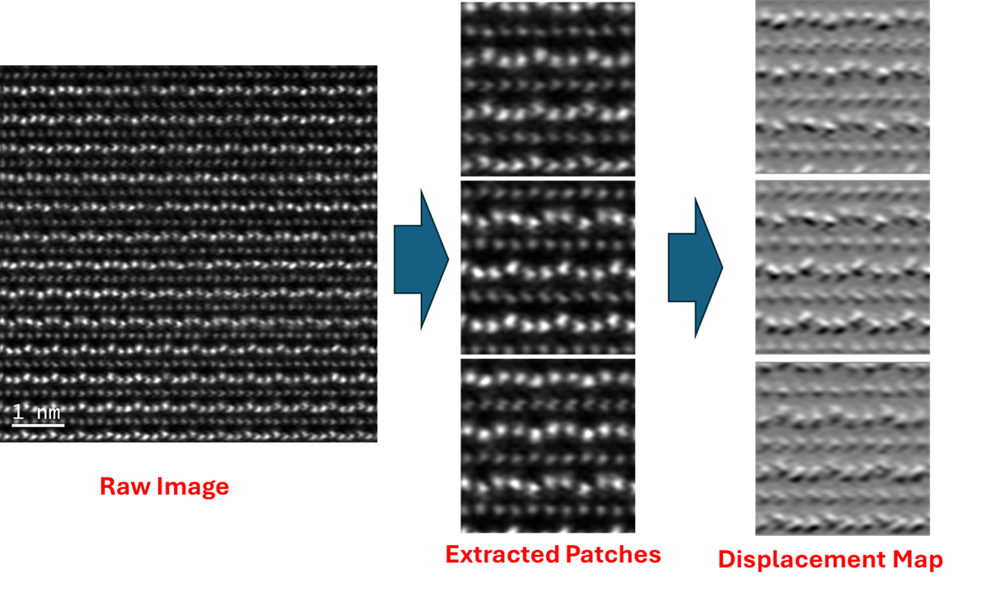

# displacement_toolkit



**A Python toolkit for atomic displacement analysis and image patching in microscopy.**

Atomic-resolution electron microscopy produces images rich with pixel-level information—often more than needed for scientific analysis. For example, if only a single atomic plane contains defects while the rest show regular periodic structure, analyzing every pixel (e.g., all 512x512 pixels in an image) is computationally excessive and may obscure the features of interest.
Instead, it is often more effective to distill the image into patterns that highlight the *displacement* of atoms from their regular lattice positions, rather than analyzing the full image pixel by pixel.

The central aim of `displacement_toolkit` is to:
- **Detect atomic peaks**: You can fine-tune the peak detection parameters on selected images and use batch conversion to extract peaks of thousands of images.
- **Map displacements from a regular lattice**: Using the Sobel operator, images can be easily converted to displacement maps. It does not perform peak finding.
- **Create displacement maps**: images that reflect only deviations from perfect periodicity, which may represent defects, local symmetries, or physical effects in the material.

Displacement maps thus provide a robust representation of the “interesting” features in atomic-scale images. They are less sensitive to noise, contrast, or brightness changes, and help abstract away irrelevant information.

## Methodologies

`displacement_toolkit` implements two complementary approaches for atomic displacement analysis:

1. **Gradient-Based Displacement Maps**
   - Uses image gradients (e.g., Sobel operators) to compute continuous displacement fields directly from the image intensity.
   - Fast, robust to noise, and does not require explicit peak detection.
   - Well-suited for visualization of general atomic plane shifts or periodic structures.

2. **Peak Finding and Lattice Fitting**
   - Detects atomic positions as local maxima ("peaks") in the image.
   - Fits a 2D lattice (using PCA and least squares) to model the ideal atomic positions.
   - Computes the displacements of each atom from the fitted lattice, providing a direct measure of local defects or deformations.

Both approaches can be used independently or together, depending on your application and the quality of your microscopy data.

## Why patch images?

For deep learning and quantitative analysis, it’s crucial to standardize image sizes and minimize artifacts. This toolkit includes patching and resizing utilities to:
- Cut large microscopy images (e.g., 1000x1000 px) into smaller, manageable patches (128x128 or 256x256 px)
- Resize patches for consistent input to ML models
- Minimize the impact of imaging artifacts, drift, or inhomogeneous scanning

If your dataset has images with different atomic densities or sizes, patching and resizing with `displacement_toolkit` helps create homogeneous, ML-ready datasets—making atom-by-atom analysis more robust and efficient.

**In summary:**  
Effortlessly extract peaks, fit lattices, compute displacement fields, and patch microscopy images for machine learning or quantitative analysis.

---

## Table of Contents

- [Overview](#overview)
- [Features](#features)
- [Installation](#installation)
- [Quick Start](#quick-start)
- [Modules](#modules)
- [Example Notebooks](#example-notebooks)
- [Dependencies](#dependencies)
- [Contributing](#contributing)
- [License](#license)
---

## Overview

`displacement_toolkit` is designed for rapid, reproducible image analysis in materials science, especially **atomic-scale microscopy**. It streamlines the workflow from image loading, patch extraction, and peak detection to advanced displacement mapping and visualization.

Whether you’re working on STEM, TEM, or related images, this toolkit helps you:
- **Find atomic peaks** robustly.
- **Fit 2D lattices** and quantify displacements.
- **Visualize displacement fields** and overlay results on original images.
- **Extract image patches** for training ML models.
- **Batch process** entire folders of images with a single call.

---

## Features

- **Peak Detection**: Fast and customizable peak finding using Gaussian filtering and local maxima search.
- **Lattice Fitting**: PCA-based 2D lattice fitting for accurate displacement measurements.
- **Displacement Mapping**: Compute and interpolate signed or unsigned displacement maps using the Sobel operator.
- **Image Patching**: Flexible patch extraction, resizing, and batch-saving utilities.
- **Visualization Tools**: Functions for overlaying peaks/displacements and creating parameter sweeps.
- **Batch Processing**: Directory-level workflows for both patching and displacement mapping.

---

## Installation

1. Clone the repository:
    ```bash
    git clone https://github.com/YOURUSERNAME/displacement_toolkit.git
    cd displacement_toolkit
    ```

2. (Recommended) Create a virtual environment:
    ```bash
    python -m venv .venv
    source .venv/bin/activate  # or .venv\Scripts\activate on Windows
    ```

3. Install required packages:
    ```bash
    pip install -r requirements.txt
    ```

---

## Quick Start

Here’s a minimal example to extract atomic peaks and compute displacement:

```bash
import numpy as np
from PIL import Image
from displacement_toolkit.peaks import find_peaks, fit_lattice, compute_displacements
from displacement_toolkit.visualization
import overlay_peaks_on_image 
```
### Load grayscale microscopy image
```bash
img = Image.open('path/to/image.tif').convert('L')
img_np = np.array(img)
```
### Detect atomic peaks
```bash
peaks = find_peaks(img_np, sigma=2, min_distance=6, threshold_abs=40)
```
### Fit lattice and compute displacements
```bash
i, j, lattice_func = fit_lattice(peaks, img_np.shape)
if lattice_func is not None:
    displacements = compute_displacements(peaks, i, j, lattice_func)
```
### Analyze or visualize as needed
### Overlay peaks on image
```bash
overlay_peaks_on_image(img_np, peaks, color='r', marker='o', markersize=5)
```
### Visualize
```bash
overlay_peaks_on_image(img_np, peaks, color='r', marker='o', markersize=5)
```
### Batch patch an entire folder:
```bash
from displacement_toolkit.patching import batch_patchify_and_resize
batch_patchify_and_resize('input_images/', 'output_patches/', patch_size=128, out_size=256, overlap=16)
```

## Modules

### `peaks.py`
- **find_peaks**: Detect local maxima in images.
- **fit_lattice**: Fit a 2D Bravais lattice using PCA and least squares.
- **compute_displacements**: Quantify deviations from the reference lattice.
- **batch_peak_find_and_displacement**: End-to-end batch workflow for folders.

### `displacement.py`
- **generate_signed_displacement_map**: Gradient-based signed displacement calculation.
- **generate_unsigned_displacement_map**: Unsigned map (absolute gradient).
- **batch_generate_displacement_map_png**: Batch-processing for entire folders.

### `patching.py` and `batch_patchify_resize.py`
- **extract_patches_and_resize**: Split images into patches, resize as needed.
- **batch_patchify_and_resize**: Folder-level batch patching.
- **patch_and_save_unlabeled**: Extract and save patches (see `image_preparation_patching.py` for advanced features).

### `visualization.py`
- **overlay_peaks_on_image**: Overlay peak positions on images.
- **show_displacement_map**: Visualize displacement fields.
- **plot_grid_of_images**: Create grids for parameter sweeps or comparisons.

### `image_preparation_patching.py`
- Handles EXIF rotation, grayscale conversion, patch-friendly cropping, and batch patching.

---

## Example Notebooks

See `notebooks/example_notebooks_ABO3.ipynb` and `example_notebooks_ferroelectric.ipynb` for live, annotated examples:
- End-to-end atomic displacement mapping.
- Parameter tuning and visualization.
- Batch patch generation for ML datasets.

---

## Dependencies

All required packages are listed in `requirements.txt`. Key libraries:
- numpy
- matplotlib
- pillow (PIL)
- scikit-image
- scikit-learn
- scipy
- tqdm
- opencv-python
- patchify

Install with:
```bash
pip install -r requirements.txt
```

## Repository Structure
```
displacement_toolkit/
├── displacement_toolkit/        # Main package directory
│   ├── __init__.py
│   ├── visualization.py
│   ├── peaks.py
│   ├── patching.py
│   ├── displacement.py
│   ├── image_preparation_patching.py
│   └── batch_patchify_resize.py
├── notebooks/
│   ├── example_notebooks_ABO3.ipynb
│   └── example_notebooks_ferroelectric.ipynb
├── example_images/
│   └── test images of different materials
├── requirements.txt
├── README.md
├── .gitignore
```

## Contributing
Contributions, issues, and feature requests are welcome!
Feel free to submit pull requests or open issues on GitHub.


## License
This project is licensed under the MIT License.


